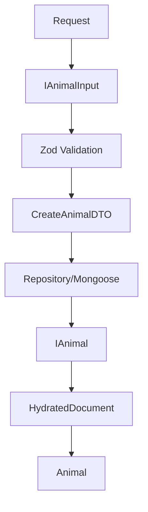

## Interface de Entrada (`IAnimalInput`)

**Representa:** Dados crus esperados da requisição (payload bruto).

**Propósito:** Tipagem inicial para capturar o formato esperado da requisição, ainda sem garantia de validade.

**Exemplo:** Dados vindos diretamente de `req.body`.

---

## DTO Pós-Validação (`CreateAnimalDTO`)

**Representa:** Dados validados e sanitizados por um parser de esquema (ex: Zod).

**Propósito:** Garantir tipos normalizados e um payload 100% seguro para uso interno.

**Exemplo:** Strings de data convertidas para objetos `Date` nativos, remoção de campos inválidos/injetados.

---

## Entidade Persistida (`IAnimal`)

**Representa:** O estado da entidade conforme salva no banco de dados.

**Propósito:** Unir as propriedades de dados puros aos metadados de persistência. Possui obrigatoriamente `_id` e timestamps.

**Exemplo:**

```typescript
type IAnimal = IBaseEntity & IAnimalInput
```

---

## Documento Hidratado (`IAnimalDocument`)

**Representa:** O documento retornado e instanciado pelo Mongoose.

**Propósito:** Fornecer acesso às propriedades da entidade em conjunto com os métodos operacionais da ODM.

**Exemplo:** Métodos como `.save()`, `.populate()`, `.toObject()`.

```typescript
type IAnimalDocument = HydratedDocument<IAnimal>
```

---

## Classe de Domínio (`Animal`)

**Representa:** Encapsulamento de comportamento e regras de negócio da entidade.

**Propósito:** Isolar a lógica de negócio da infraestrutura. Ela encapsula um objeto `IAnimal` internamente, garantindo que as operações respeitem as invariantes do domínio.

**Diferencial:** Não representa persistência e não serve apenas para "manipular dados"; ela é a tradução viva do comportamento do domínio da aplicação.

---

## Fluxo Arquitetural dos Dados

O ciclo de vida de um dado segue um fluxo linear e previsível, mudando de representação à medida que atravessa as barreiras arquiteturais do sistema:



**Etapas:**

1. **Request:** O cliente envia uma requisição HTTP.
2. **IAnimalInput:** O payload é mapeado em seu formato bruto.
3. **Zod Validation:** O esquema valida a integridade do payload.
4. **CreateAnimalDTO:** Os dados limpos e tipados são distribuídos para os casos de uso / serviços.
5. **Repository/Mongoose:** A infraestrutura processa a persistência.
6. **IAnimal:** O banco retorna ou mapeia a estrutura com suas propriedades persistidas.
7. **HydratedDocument:** O Mongoose adiciona as capacidades de gerenciamento de estado do banco.
8. **Animal (Domínio):** O documento é encapsulado pela classe de domínio para a execução segura de comportamentos e regras de negócio.
