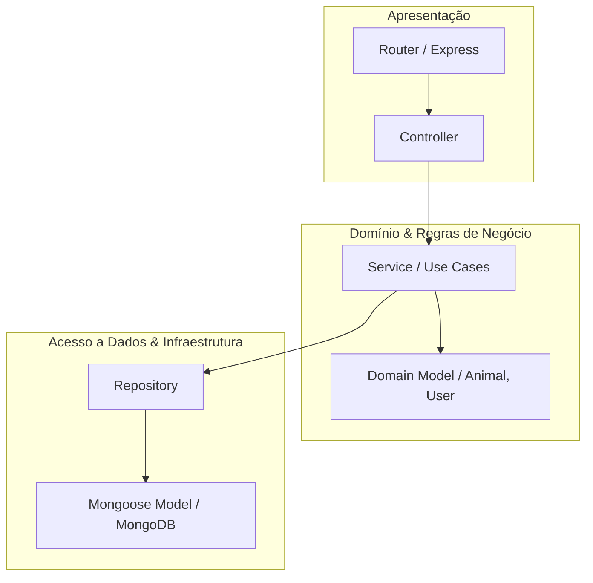
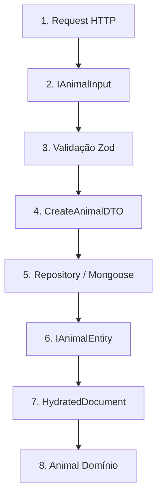

# Arquitetura e Padrões de Projeto (Design Patterns)

Este documento descreve a arquitetura de software, o fluxo de dados e os padrões de projeto adotados no desenvolvimento do backend do **Better Pets**.

---

## 1. Visão Geral da Arquitetura

O sistema é construído sobre os princípios da **Clean Architecture** e do **Domain-Driven Design (DDD)**, adaptados para uma API Express com TypeScript. A estrutura visa o baixo acoplamento, alta coesão, testabilidade e separação clara de responsabilidades através de camadas bem definidas.



---

## 2. Estrutura de Diretórios (`source/`)

A organização do código reflete a separação de responsabilidades:

*   [core/](file:///c:/Projetos/Geral/better-pets/better-pets-backend/source/core): Classes base abstratas (`BaseRouter`, `BaseController`, `BaseRepository`, `BaseService`) que contêm comportamentos comuns e reduzem código duplicado.
*   [controllers/](file:///c:/Projetos/Geral/better-pets/better-pets-backend/source/controllers): Camada de interface de entrada (HTTP). Valida inputs e direciona para os serviços.
*   [services/](file:///c:/Projetos/Geral/better-pets/better-pets-backend/source/services): Onde reside a lógica de negócios e as regras de domínio.
*   [repositories/](file:///c:/Projetos/Geral/better-pets/better-pets-backend/source/repositories): Camada de acesso ao banco de dados (MongoDB via Mongoose).
*   [models/](file:///c:/Projetos/Geral/better-pets/better-pets-backend/source/models): Definições de entidades de domínio pura e contratos de dados.
*   [schemas/](file:///c:/Projetos/Geral/better-pets/better-pets-backend/source/schemas): Definições de schemas do Mongoose para persistência.
*   [routers/](file:///c:/Projetos/Geral/better-pets/better-pets-backend/source/routers): Definição de rotas HTTP mapeadas para as controllers correspondentes.
*   [validation/](file:///c:/Projetos/Geral/better-pets/better-pets-backend/source/validation): Schemas de validação Zod (divididos em `rules` e `validation`).
*   [middlewares/](file:///c:/Projetos/Geral/better-pets/better-pets-backend/source/middlewares): Filtros e interceptadores HTTP (tratamento de erros, upload, etc.).
*   [errors/](file:///c:/Projetos/Geral/better-pets/better-pets-backend/source/errors): Erros customizados da aplicação (`ApiError`, `BadValidationError`).
*   [utils/](file:///c:/Projetos/Geral/better-pets/better-pets-backend/source/utils): Funções utilitárias (paginação, ordenação, formatação de respostas).
*   [types/](file:///c:/Projetos/Geral/better-pets/better-pets-backend/source/types): Tipagens compartilhadas do TypeScript.

---

## 3. Camadas do Padrão Controller-Service-Repository (CSR)

### 3.1. Controller (Apresentação / HTTP)
*   **Responsabilidade:** Receber a requisição HTTP, extrair parâmetros, cookies ou headers, validar os dados de entrada usando o Zod e invocar a camada de serviço correspondente.
*   **Herança:** Herda de [BaseController](file:///c:/Projetos/Geral/better-pets/better-pets-backend/source/core/base.controller.ts) para ganhar acesso simplificado à validação de query parameters, paginação e filtros.
*   **Resposta:** Utiliza a classe utilitária [ResponseHandler](file:///c:/Projetos/Geral/better-pets/better-pets-backend/source/utils/response-handler.ts) para padronizar o payload JSON de resposta e os status HTTP.

### 3.2. Service (Regras de Negócio)
*   **Responsabilidade:** Concentrar toda a lógica operacional e regras de negócio da aplicação. O serviço é totalmente agnóstico em relação ao protocolo de comunicação (não sabe que está rodando em um servidor Express HTTP).
*   **Fluxo:** Invoca repositories para ler e salvar dados, processa e valida invariants de negócio, e lança instâncias de [ApiError](file:///c:/Projetos/Geral/better-pets/better-pets-backend/source/errors/api.error.ts) quando as regras de negócio são violadas.

### 3.3. Repository (Infraestrutura / Persistência)
*   **Responsabilidade:** Isolar a infraestrutura do banco de dados (Mongoose/MongoDB) das demais camadas.
*   **Herança:** Estende [BaseRepository](file:///c:/Projetos/Geral/better-pets/better-pets-backend/source/core/base.repository.ts), que fornece implementações genéricas de CRUD (`create`, `findById`, `list`, `update`, `delete`, `exists`).
*   **Benefício:** Se amanhã mudarmos de MongoDB para PostgreSQL, apenas os repositories de infraestrutura precisarão ser reescritos; as controllers e serviços permanecerão intactos.

---

## 4. Ciclo de Vida dos Dados (Representações & DTOs)

Para manter a segurança e a integridade em todas as fronteiras da aplicação, os dados assumem diferentes formatos/tipagens conforme avançam nas camadas:



### Detalhamento das Etapas e Representações:

1.  **Request HTTP:** O payload bruto (geralmente vindo de `req.body` ou `req.query`).
2.  **Input Interface (`IAnimalInput` / `IUserInput`):** Representa o formato esperado dos dados crus antes de qualquer verificação. É um tipo typescript estritamente descritivo.
3.  **Validação Zod:** Parser de esquema Zod que analisa o input e garante sua validade estrutural e lógica.
4.  **Data Transfer Object (DTO):** Dados limpos, convertidos e sanitizados pela validação Zod. São estruturas 100% confiáveis que trafegam entre as controllers e os serviços.
5.  **Repository / Mongoose:** Recebe o DTO e executa a operação no banco através dos Schemas do Mongoose.
6.  **Entity Interface (`IAnimalEntity` / `IUserEntity`):** O formato final de persistência que une o input aos metadados do banco (`_id`, `createdAt`, `updatedAt`). Estende a interface [BaseEntity](file:///c:/Projetos/Geral/better-pets/better-pets-backend/source/models/entity.model.ts).
7.  **HydratedDocument:** A instância ativa do Mongoose com métodos operacionais acoplados (`.save()`, `.populate()`, etc.).
8.  **Classe de Domínio (`Animal` / `User`):** Encapsula a entidade de persistência para execução isolada de regras de negócio, garantindo que o domínio não vaze detalhes da infraestrutura.

---

## 5. Abstrações Base (`source/core`)

O projeto utiliza herança e genéricos para manter o código DRY (*Don't Repeat Yourself*):

*   **`BaseRouter`:** Responsável por inicializar as rotas do Express de forma declarativa. Todas as controllers acopladas às rotas têm seus métodos encapsulados automaticamente em um `asyncHandler` genérico. Isso garante que qualquer erro síncrono ou assíncrono seja capturado e direcionado para o middleware global de tratamento de erros, eliminando a necessidade de blocos repetitivos de `try/catch` nas controllers.
*   **`BaseController`:** Fornece um método protegido `getQueryParams` que extrai, padroniza e valida de forma automática parâmetros de paginação (`page`, `limit`), ordenação (`sortBy`, `sortOrder`) e filtros baseados em schemas Zod.
*   **`BaseRepository`:** Recebe um modelo Mongoose por injeção de dependência via construtor e disponibiliza métodos genéricos fortemente tipados para CRUD.

---

## 6. Padrão de Validação com Zod

A validação é organizada em duas etapas para maximizar o reaproveitamento de código e garantir a conformidade com as tipagens do TypeScript:

1.  **Rules (`user.rules.ts`, `animal.rules.ts`):** Objetos contendo a definição elementar de validação para cada campo. Eles utilizam a cláusula `satisfies` associada a um utilitário genérico `ZodEntityRules<T>` para garantir, em tempo de compilação, que todos os campos do modelo de domínio estejam cobertos por uma regra Zod correspondente.
2.  **Validations (`user.validation.ts`, `animal.validation.ts`):** Composição e refinamento dos objetos de regras para criar schemas específicos para cada caso de uso (ex: `create`, `update`, `filter`).

### Exemplo de Aplicação das Regras:
```typescript
// Exemplo conceitual da união de regras e validação
export const animalRules = {
  name: z.string().min(2),
  weight: z.number().positive()
} satisfies { [K in keyof ZodEntityRules<IAnimalInput>]: z.ZodType }

export class AnimalValidations {
  static create = z.object(animalRules).strict()
  static update = z.object(animalRules).partial().strict()
}
```

---

## 7. Tratamento Centralizado de Erros e Respostas

### 7.1. Padronização de Respostas
Toda resposta HTTP bem-sucedida ou com falha segue um contrato estrito, definido nas interfaces de [types/response.ts](file:///c:/Projetos/Geral/better-pets/better-pets-backend/source/types/response.ts):

*   **Sucesso:**
    ```json
    {
      "success": true,
      "code": 200,
      "message": "Mensagem de sucesso",
      "data": { ... }
    }
    ```
*   **Falha:**
    ```json
    {
      "success": false,
      "code": 400,
      "message": "Detalhes sobre o erro",
      "error": { ... }
    }
    ```

### 7.2. Middleware Global de Erros
O middleware centralizado [error-middleware.ts.ts](file:///c:/Projetos/Geral/better-pets/better-pets-backend/source/middlewares/error-middleware.ts.ts) intercepta todas as exceções lançadas nos serviços, controllers ou rotas:
*   **`BadValidationError` (Zod):** Retorna status 400 com a lista de problemas de validação encontrados.
*   **`ApiError`:** Retorna o status HTTP customizado correspondente à regra de negócio violada (ex: 404 para entidades não encontradas, 409 para conflitos de nomes).
*   **Erros não mapeados:** Retorna status 500 para evitar o vazamento de detalhes internos da infraestrutura.

---

## 8. Documentação Dinâmica (OpenAPI / Swagger)

Em vez de escrever arquivos YAML/JSON estáticos para a documentação, o projeto gera documentação OpenAPI dinamicamente a partir dos schemas de validação do Zod, utilizando a biblioteca `@asteasolutions/zod-to-openapi`.

*   Os schemas Zod são enriquecidos com metadados OpenAPI usando o método `.openapi()`.
*   Rotas e esquemas de requisição/resposta são mapeados programaticamente (como em [source/docs/animal.docs.ts](file:///c:/Projetos/Geral/better-pets/better-pets-backend/source/docs/animal.docs.ts)).
*   A documentação atualizada fica disponível no endpoint `/api-docs` integrado ao Swagger UI, garantindo que qualquer alteração de validação reflita automaticamente na documentação da API.
