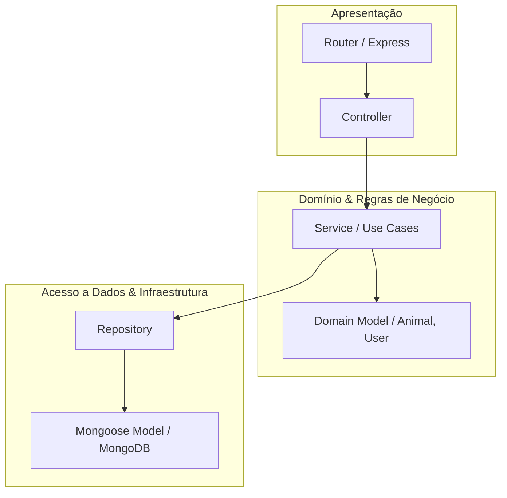
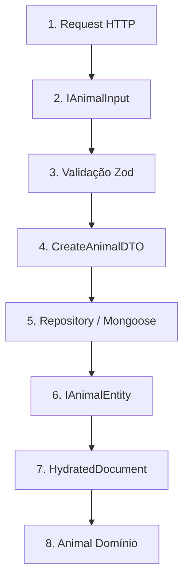

# Arquitetura e Padrões de Projeto (Design Patterns)

Este documento descreve a arquitetura de software, o fluxo de dados e os padrões de projeto adotados no desenvolvimento do backend do **Better Pets**.

---

## 1. Visão Geral da Arquitetura

O sistema é construído sobre os princípios da **Clean Architecture** e do **Domain-Driven Design (DDD)**, adaptados para uma API Express com TypeScript. A estrutura visa o baixo acoplamento, alta coesão, testabilidade e separação clara de responsabilidades através de camadas bem definidas.



---

## 2. Estrutura de Diretórios (`source/`)

A organização do código reflete uma estrutura orientada a domínios (Domain-Driven / Feature-Folder), agrupando o código por funcionalidade/entidade para maior coesão, em vez de uma divisão estritamente horizontal global:

*   [app.ts](file:///c:/Projetos/Geral/better-pets/better-pets-backend/source/app.ts): Ponto de entrada (Entrypoint) da aplicação. Configura o Express, middlewares globais, rotas e inicializa a conexão com o banco de dados.
*   [config/](file:///c:/Projetos/Geral/better-pets/better-pets-backend/source/config): Configurações globais da aplicação, incluindo inicialização do banco de dados ([database.ts](file:///c:/Projetos/Geral/better-pets/better-pets-backend/source/config/database.ts)), Swagger ([swagger.ts](file:///c:/Projetos/Geral/better-pets/better-pets-backend/source/config/swagger.ts)) e extensão do Zod ([zod.ts](file:///c:/Projetos/Geral/better-pets/better-pets-backend/source/config/zod.ts)).
*   [core/](file:///c:/Projetos/Geral/better-pets/better-pets-backend/source/core): Classes base abstratas e interfaces compartilhadas ([BaseRouter](file:///c:/Projetos/Geral/better-pets/better-pets-backend/source/core/base.router.ts), [BaseController](file:///c:/Projetos/Geral/better-pets/better-pets-backend/source/core/base.controller.ts), [BaseRepository](file:///c:/Projetos/Geral/better-pets/better-pets-backend/source/core/base.repository.ts), [BaseService](file:///c:/Projetos/Geral/better-pets/better-pets-backend/source/core/base.service.ts), [BaseEntity](file:///c:/Projetos/Geral/better-pets/better-pets-backend/source/core/base.entity.ts)) que definem contratos e comportamentos genéricos.
*   [domains/](file:///c:/Projetos/Geral/better-pets/better-pets-backend/source/domains): Onde residem os módulos de negócio divididos por domínio (ex: [animals](file:///c:/Projetos/Geral/better-pets/better-pets-backend/source/domains/animals), [users](file:///c:/Projetos/Geral/better-pets/better-pets-backend/source/domains/users), [health](file:///c:/Projetos/Geral/better-pets/better-pets-backend/source/domains/health)). Cada pasta de domínio encapsula suas próprias camadas (controllers, services, repositories, schemas, models, rules, validation e docs).
*   [services/](file:///c:/Projetos/Geral/better-pets/better-pets-backend/source/services): Serviços globais ou de integração com sistemas externos que não pertencem a um domínio único (ex: [unsplash.service.ts](file:///c:/Projetos/Geral/better-pets/better-pets-backend/source/services/unsplash.service.ts)).
*   [validation/](file:///c:/Projetos/Geral/better-pets/better-pets-backend/source/validation): Validações e schemas Zod globais e compartilhados (ex: [validation/global](file:///c:/Projetos/Geral/better-pets/better-pets-backend/source/validation/global)).
*   [middlewares/](file:///c:/Projetos/Geral/better-pets/better-pets-backend/source/middlewares): Filtros e interceptadores HTTP (tratamento de erros, upload, etc., como o [error-middleware.ts.ts](file:///c:/Projetos/Geral/better-pets/better-pets-backend/source/middlewares/error-middleware.ts.ts)).
*   [errors/](file:///c:/Projetos/Geral/better-pets/better-pets-backend/source/errors): Erros customizados da aplicação ([ApiError](file:///c:/Projetos/Geral/better-pets/better-pets-backend/source/errors/api.error.ts), [BadValidationError](file:///c:/Projetos/Geral/better-pets/better-pets-backend/source/errors/bad-validation.error.ts)).
*   [utils/](file:///c:/Projetos/Geral/better-pets/better-pets-backend/source/utils): Funções utilitárias compartilhadas (paginação, ordenação, formatação de respostas).
*   [types/](file:///c:/Projetos/Geral/better-pets/better-pets-backend/source/types): Tipagens e enums compartilhados do TypeScript.
*   [__tests__/](file:///c:/Projetos/Geral/better-pets/better-pets-backend/source/__tests__): Testes automatizados e de integração da aplicação (ex: [animal-service.test.ts](file:///c:/Projetos/Geral/better-pets/better-pets-backend/source/__tests__/animal-service.test.ts)).

---

## 3. Camadas do Padrão Controller-Service-Repository (CSR)

Embora estruturadas sob o padrão Controller-Service-Repository (CSR), as camadas de cada recurso estão agrupadas dentro de seu respectivo domínio na pasta [domains/](file:///c:/Projetos/Geral/better-pets/better-pets-backend/source/domains) (ex: [animals](file:///c:/Projetos/Geral/better-pets/better-pets-backend/source/domains/animals)). Essa co-localização mantém o código relacionado próximo, facilitando a manutenção.

### 3.1. Controller (Apresentação / HTTP)
*   **Responsabilidade:** Receber a requisição HTTP, extrair parâmetros, cookies ou headers, validar os dados de entrada usando o Zod e invocar a camada de serviço correspondente.
*   **Validação de Entrada:** A validação é delegada a funções utilitárias compartilhadas como [validateOrThrow](file:///c:/Projetos/Geral/better-pets/better-pets-backend/source/utils/validate-or-throw.ts) (que gera erros de validação a partir dos schemas Zod do domínio) e [validateObjectIdOrThrow](file:///c:/Projetos/Geral/better-pets/better-pets-backend/source/utils/validate-object-id-or-throw.ts) (que valida os IDs recebidos na rota usando o [objectIdSchema](file:///c:/Projetos/Geral/better-pets/better-pets-backend/source/validation/global/objectid.validation.ts)).
*   **Herança:** Herda de [BaseController](file:///c:/Projetos/Geral/better-pets/better-pets-backend/source/core/base.controller.ts) para ganhar acesso simplificado à extração e validação de parâmetros de query, paginação e filtros.
*   **Resposta:** Utiliza a classe utilitária [ResponseHandler](file:///c:/Projetos/Geral/better-pets/better-pets-backend/source/utils/response-handler.ts) para padronizar o payload JSON de resposta e os status HTTP.

### 3.2. Service (Regras de Negócio)
*   **Responsabilidade:** Concentrar toda a lógica operacional e regras de negócio da aplicação. O serviço é totalmente agnóstico em relação ao protocolo de comunicação (não sabe que está rodando em um servidor Express HTTP).
*   **Fluxo:** Invoca repositories para ler e salvar dados, processa e valida invariants de negócio, e lança instâncias de [ApiError](file:///c:/Projetos/Geral/better-pets/better-pets-backend/source/errors/api.error.ts) quando as regras de negócio são violadas.

### 3.3. Repository (Infraestrutura / Persistência)
*   **Responsabilidade:** Isolar a infraestrutura do banco de dados (Mongoose/MongoDB) das demais camadas.
*   **Herança:** Estende [BaseRepository](file:///c:/Projetos/Geral/better-pets/better-pets-backend/source/core/base.repository.ts), que fornece implementações genéricas de CRUD (`create`, `findById`, `list`, `update`, `delete`, `exists`).
*   **Benefício:** Se amanhã mudarmos de MongoDB para PostgreSQL, apenas os repositories de infraestrutura precisarão ser reescritos; as controllers e serviços permanecerão intactos.

---

## 4. Ciclo de Vida dos Dados (Representações & DTOs)

Para manter a segurança e a integridade em todas as fronteiras da aplicação, os dados assumem diferentes formatos/tipagens conforme avançam nas camadas:



### Detalhamento das Etapas e Representações:

1.  **Request HTTP:** O payload bruto (geralmente vindo de `req.body` ou `req.query`).
2.  **Input Interface (`IAnimalInput` / `IUserInput`):** Representa o formato esperado dos dados crus antes de qualquer verificação. É um tipo typescript estritamente descritivo.
3.  **Validação Zod:** Parser de esquema Zod que analisa o input e garante sua validade estrutural e lógica.
4.  **Data Transfer Object (DTO):** Dados limpos, convertidos e sanitizados pela validação Zod. São estruturas 100% confiáveis que trafegam entre as controllers e os serviços.
5.  **Repository / Mongoose:** Recebe o DTO e executa a operação no banco através dos Schemas do Mongoose.
6.  **Entity Interface (`IAnimalEntity` / `IUserEntity`):** O formato final de persistência que une o input aos metadados do banco (`_id`, `createdAt`, `updatedAt`). Estende a interface [BaseEntity](file:///c:/Projetos/Geral/better-pets/better-pets-backend/source/core/base.entity.ts).
7.  **HydratedDocument:** A instância ativa do Mongoose com métodos operacionais acoplados (`.save()`, `.populate()`, etc.).
8.  **Classe de Domínio (`Animal` / `User`):** Encapsula a entidade de persistência para execução isolada de regras de negócio, garantindo que o domínio não vaze detalhes da infraestrutura.

---

## 5. Abstrações Base (`source/core`)

O projeto utiliza herança e genéricos na pasta [core/](file:///c:/Projetos/Geral/better-pets/better-pets-backend/source/core) para manter o código DRY (*Don't Repeat Yourself*):

*   **[BaseRouter](file:///c:/Projetos/Geral/better-pets/better-pets-backend/source/core/base.router.ts):** Responsável por inicializar as rotas do Express de forma declarativa. Ele recebe um prefixo do tipo `EndpointNames` e um array de objetos `IRoute`. Todos os route handlers e middlewares da rota são encapsulados automaticamente em um wrapper `asyncHandler` interno da classe. Isso garante que qualquer erro síncrono ou assíncrono seja capturado (`try/catch`) e direcionado via `next(error)` para o middleware global de tratamento de erros, eliminando a necessidade de blocos redundantes de `try/catch` nas controllers.
*   **[BaseController](file:///c:/Projetos/Geral/better-pets/better-pets-backend/source/core/base.controller.ts):** Fornece o método protegido `getQueryParams` que extrai da query string e valida os parâmetros globais de paginação (`page`, `limit` contra [paginationSchema](file:///c:/Projetos/Geral/better-pets/better-pets-backend/source/validation/global/pagination.validation.ts)), ordenação (`sortBy`, `sortOrder` contra [sortSchema](file:///c:/Projetos/Geral/better-pets/better-pets-backend/source/validation/global/sorting.validation.ts)) e quaisquer filtros adicionais específicos de domínio passados por um schema Zod.
*   **[BaseRepository](file:///c:/Projetos/Geral/better-pets/better-pets-backend/source/core/base.repository.ts):** Classe genérica fortemente tipada que recebe o modelo Mongoose correspondente e encapsula as operações CRUD básicas no MongoDB (`create`, `exists`, `list` com paginação/ordenação nativas, `findById`, `update` e `delete`).
*   **[BaseEntity](file:///c:/Projetos/Geral/better-pets/better-pets-backend/source/core/base.entity.ts):** Interface TypeScript base que define a estrutura de identificadores únicos (`_id`) e timestamps automáticos (`createdAt`, `updatedAt`) de persistência.
*   **[BaseService](file:///c:/Projetos/Geral/better-pets/better-pets-backend/source/core/base.service.ts):** Classe abstrata base da qual derivam os serviços específicos de domínio da aplicação.

---

## 6. Padrão de Validação com Zod

Para enriquecer os schemas com documentação do Swagger, a aplicação utiliza a biblioteca `@asteasolutions/zod-to-openapi`. A configuração global que estende o Zod é feita no arquivo [config/zod.ts](file:///c:/Projetos/Geral/better-pets/better-pets-backend/source/config/zod.ts), do qual todos os outros módulos devem importar o objeto `z`.

A validação é estruturada em duas etapas principais dentro de cada domínio:

1.  **Rules ([animal.rules.ts](file:///c:/Projetos/Geral/better-pets/better-pets-backend/source/domains/animals/animal.rules.ts), [user.rules.ts](file:///c:/Projetos/Geral/better-pets/better-pets-backend/source/domains/users/user.rules.ts)):** Objetos que definem as validações primitivas de cada campo do modelo. Eles utilizam a cláusula `satisfies ZodEntityRules<T>` (ou `ZodFilterRules<T>`) importada de [zod-types.ts](file:///c:/Projetos/Geral/better-pets/better-pets-backend/source/utils/zod-types.ts) para assegurar em tempo de compilação que todos os campos obrigatórios da entidade estão cobertos.
2.  **Validations ([animal.validation.ts](file:///c:/Projetos/Geral/better-pets/better-pets-backend/source/domains/animals/animal.validation.ts), [user.validation.ts](file:///c:/Projetos/Geral/better-pets/better-pets-backend/source/domains/users/user.validation.ts)):** Schemas Zod finais de caso de uso (`create`, `update`, `filter`) construídos com base nas regras primitivas, estendidos com metadados OpenAPI usando `.openapi()` e exportados como propriedades estáticas de uma classe de validação.

### Exemplo do Padrão Atual de Validação:
```typescript
import { z } from '../../config/zod'
import { ZodEntityRules } from '../../utils/zod-types'
import { IAnimalInput } from './animal.model'

// 1. Definição das Regras (animal.rules.ts)
export const animalRules = {
  name: z.string().min(2),
  weight: z.number().positive()
} satisfies ZodEntityRules<IAnimalInput>

// 2. Criação dos Schemas e Validações (animal.validation.ts)
const createAnimalSchema = z
  .object(animalRules)
  .strict()
  .openapi('CreateAnimal')

const updateAnimalSchema = z
  .object(animalRules)
  .partial()
  .openapi('UpdateAnimal')

export class AnimalValidations {
  static create = createAnimalSchema
  static update = updateAnimalSchema
}

// DTOs inferidos a partir das validações da classe
export type CreateAnimalDTO = z.infer<typeof AnimalValidations.create>
```

---

## 7. Tratamento Centralizado de Erros e Respostas

### 7.1. Padronização de Respostas
Toda resposta HTTP bem-sucedida ou com falha segue um contrato estrito, definido nas interfaces de [types/response.ts](file:///c:/Projetos/Geral/better-pets/better-pets-backend/source/types/response.ts):

*   **Sucesso:**
    ```json
    {
      "success": true,
      "code": 200,
      "message": "Mensagem de sucesso",
      "data": { ... }
    }
    ```
*   **Falha:**
    ```json
    {
      "success": false,
      "code": 400,
      "message": "Detalhes sobre o erro",
      "error": { ... }
    }
    ```

### 7.2. Middleware Global de Erros
O middleware centralizado [error-middleware.ts.ts](file:///c:/Projetos/Geral/better-pets/better-pets-backend/source/middlewares/error-middleware.ts.ts) intercepta todas as exceções lançadas nos serviços, controllers ou rotas:
*   **`BadValidationError` (Zod/utilitários):** Retorna status 400 (Bad Request) juntamente com a lista estruturada de campos e mensagens de validação que falharam.
*   **`ApiError`:** Retorna o status HTTP customizado configurado na própria exceção (como 404 Not Found para recursos inexistentes ou 409 Conflict para violação de alguma lógica operacional).
*   **`MongoServerError` (com código 11000):** Identifica violações de chave única do banco de dados (por exemplo, nome de animal ou e-mail duplicado) e responde automaticamente com status 409 (Conflict).
*   **Erros não mapeados:** Qualquer erro inesperado é mascarado e retorna status 500 (Internal Server Error) para evitar a exposição de detalhes de infraestrutura ou falhas de segurança em produção.

---

## 8. Documentação Dinâmica (OpenAPI / Swagger)

Em vez de escrever arquivos YAML/JSON estáticos para a documentação, o projeto gera documentação OpenAPI dinamicamente a partir dos schemas de validação do Zod e do roteamento programático:

*   Os schemas Zod são enriquecidos com metadados OpenAPI e nomes de modelo usando o método `.openapi('NomeModelo')` na camada de validação.
*   Rotas, parâmetros de caminho (path parameters), payloads de requisição e respostas HTTP (usando auxiliares estruturados como `ResponseSchema.success` e `ResponseSchema.error` de [response.validation.ts](file:///c:/Projetos/Geral/better-pets/better-pets-backend/source/validation/response.validation.ts)) são mapeados programaticamente na camada de documentação de cada domínio (ex: [animal.docs.ts](file:///c:/Projetos/Geral/better-pets/better-pets-backend/source/domains/animals/animal.docs.ts)).
*   Esses mapeamentos de rotas são exportados e registrados em lote no `OpenAPIRegistry` em [swagger.ts](file:///c:/Projetos/Geral/better-pets/better-pets-backend/source/config/swagger.ts) através do método `registry.registerPath()`.
*   O documento final consolidado é gerado dinamicamente usando `generateSwaggerDocs()` e exposto via Swagger UI na rota `/api-docs` em [app.ts](file:///c:/Projetos/Geral/better-pets/better-pets-backend/source/app.ts). Qualquer nova rota ou mudança de validação é refletida de forma imediata na API-Docs.
